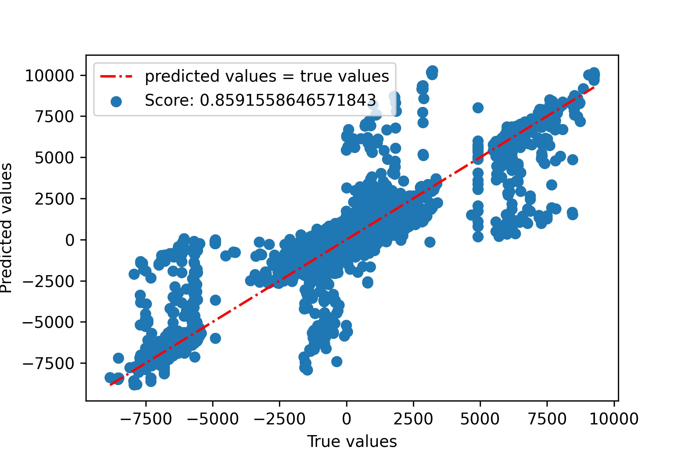

# Deep ViCTORIA

Deep ViCTORIA is a UCI chess engine built with C++.

It performs an in-depth analysis and uses a neural network to evaluate each chess board.

It can perform an analysis in reasonable time between depth 15 and 20+ depending on the number of possible moves.

Its elo rating is 2287 in 10 minutes games ([Lichess](https://lichess.org/) May 2021).

Deep ViCTORIA is not a complete chess program and requires a UCI-compatible graphical user
interface (GUI) (e.g. XBoard with PolyGlot, Scid, Cute Chess, eboard, Arena, Sigma Chess,
Shredder, Chess Partner or Fritz) in order to be used comfortably.

## Build
`cd Engine`

In order to build Deep ViCTORIA, you need [CMake](https://cmake.org/).
Then:
```bash
cd build
cmake ..
make
```

## Usage
```bash
./Deep_VICTORIA
```

## Most used UCI commands:
+ `position starpos [moves move_list]`
+ `position fen your_fen [moves move_list]`
+ `go depth n`
+ `go infinite`: search until you enter `stop`
+ `go movetime t`: search for t milliseconds
+ `go wtime t1 btime t2 [winc t3 binc t4]`: Whites has `t1` ms on clock Blacks has `t2` ms on clock. Whites increment their time by `t3` ms and Blacks increment their time by `t4` ms
+ `go nodes n` search for n nodes (In fact, the number of nodes explored will be a bit greater than *n*)

## Neural Network
+ I use Tensorflow and Python to create a neural network.
+ All the Python and Jupyter files to create the dataset and train the network are available in the `ANN` directory.
+ The goal of the network is to perform a regression to recreate the evaluation function of a chess engine.
  You can emulate any chess engine (I have chosen Stockfish 13, but it could have been Leela or Komodo...): for each position in your dataset, you perform an evaluation with the engine of your choice, and you save the result along the position in a new dataset (the best is to have a command which give the static evaluation of the position like the `eval` command in Stockfish. If there is no such command, search at depth 1). Then you can perform regression.
  
+ Currently, the network is trained on 58 million positions, recovered from the [Lichess database](https://database.lichess.org).
+ The position are encoded as vectors of dimension 131: 64 * 2 (color of the piece + piece type: rook, pawn...) + castlings rights + en passant square + Whites to play.
+ The structure of the neural network:
```
_________________________________________________________________
Layer (type)                 Output Shape              Param #   
=================================================================
input_1 (InputLayer)         [(None, 131)]             0         
_________________________________________________________________
dense (Dense)                (None, 131)               17292     
_________________________________________________________________
dense_1 (Dense)              (None, 64)                8448      
_________________________________________________________________
dense_2 (Dense)              (None, 1)                 65        
=================================================================
Total params: 25,805
Trainable params: 25,805
Non-trainable params: 0
_________________________________________________________________
```
Each *Dense* layer uses `relu` as the activation function except the last one which uses `linear`.

+ Using the [R² metric](https://en.wikipedia.org/wiki/Coefficient_of_determination), the model has a score of about 0.86:



## Notes
+ Since Deep_ViCTORIA uses a neural network, the evaluation function is much more slower than a 'standard' one. So I needed a very optimized search algorithm and board representation. I first tried to use those from my previous engine [ViCTORIA](https://github.com/LE10EENFAIT/ViCTORIA) but it was too slow. So I decided to use those from [Stockfish](https://github.com/official-stockfish/Stockfish).
  
+ I use my own implementation of neural network in C++ called [Neural Net](https://github.com/LE10EENFAIT/NeuralNet).

## Credits
+ [Stockfish](https://github.com/official-stockfish/Stockfish)

## License
[GPL v3](https://choosealicense.com/licenses/gpl-3.0/)